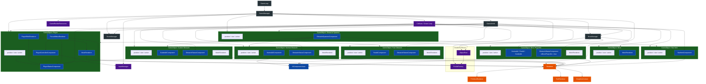

# SuperDodge Object-Component Map

```mermaid
flowchart TD
    App["GameLoop"]
    GM["GameManager"]
    World["GameWorld"]

    App --> GM
    GM --> World
    GM --> ScoreManager["ScoreManager"]
    GM --> BossManager["BossManager"]
    GM --> RenderResources["GameRenderResources"]
    GM --> InputManager["InputManager"]

    subgraph FactoriesAndPools["Creation / Reuse"]
        PrefabFactory["PrefabFactory"]
        ObjectPool["ObjectPool"]
    end

    GM --> PrefabFactory
    GM --> PlayerObject
    GM --> SpawnerObject
    BossManager --> BossObject
    BossManager --> ObjectPool
    ObjectPool --> PrefabFactory

    World --> PlayerObject
    World --> SpawnerObject
    World --> NormalObstacle
    World --> FastObstacle
    World --> GuidedObstacle
    World --> StarItem
    World --> BossObject
    World --> BossProjectile

    subgraph PlayerObject["GameObject: Player"]
        PlayerTransform["position / size / active"]
        PlayerMesh["MeshRenderer"]
        FocusHitbox["FocusHitboxRenderer"]
        PlayerStatus["PlayerStatusComponent"]
        PlayerBlink["PlayerBlinkRenderer"]
        PlayerController["PlayerControllerComponent"]
    end

    PlayerController --> InputManager
    PlayerController --> PlayerStatus
    PlayerBlink --> PlayerStatus
    PlayerBlink --> PlayerMesh
    FocusHitbox --> PlayerController
    FocusHitbox --> PlayerStatus

    subgraph SpawnerObject["GameObject: Obstacle Spawner"]
        SpawnerTransform["position / size / active"]
        ObstacleSpawner["ObstacleSpawnerComponent"]
    end

    ObstacleSpawner --> ObjectPool
    ObstacleSpawner --> PlayerObject
    ObstacleSpawner --> StarItem
    ObstacleSpawner --> NormalObstacle
    ObstacleSpawner --> FastObstacle
    ObstacleSpawner --> GuidedObstacle

    subgraph NormalObstacle["GameObject: Normal Obstacle"]
        NormalTransform["position / size / active"]
        NormalMesh["MeshRenderer"]
        NormalStatus["ObstacleStatusComponent"]
        NormalAI["NormalAIComponent"]
    end

    subgraph FastObstacle["GameObject: Fast Obstacle"]
        FastTransform["position / size / active"]
        FastMesh["MeshRenderer"]
        FastStatus["ObstacleStatusComponent"]
        FastAI["FastAIComponent"]
    end

    subgraph GuidedObstacle["GameObject: Guided Obstacle"]
        GuidedTransform["position / size / active"]
        GuidedMesh["MeshRenderer"]
        GuidedStatus["ObstacleStatusComponent"]
        GuidedAI["GuidedAIComponent"]
    end

    NormalAI --> AIBase["AIComponent base"]
    FastAI --> AIBase
    GuidedAI --> AIBase
    GuidedAI --> PlayerStatus

    subgraph StarItem["GameObject: Star Item"]
        StarTransform["position / size / active"]
        StarComponent["StarItemComponent"]
    end

    subgraph BossObject["GameObject: Boss"]
        BossTransform["position / size / active"]
        BossMesh["MeshRenderer"]
    end

    subgraph BossProjectile["GameObject: Boss Projectile"]
        BossProjectileTransform["position / size / active"]
        BossProjectileMesh["MeshRenderer"]
        BossProjectileStatus["ObstacleStatusComponent<br/>isBossProjectile = true"]
        BossProjectileAI["NormalAI / FastAI / GuidedAI"]
    end

    BossProjectileAI --> AIBase
    BossManager --> BossProjectileStatus
    BossManager --> BossProjectileAI

    GM --> CollisionLoop["Collision / Graze Loop"]
    CollisionLoop --> PlayerStatus
    CollisionLoop --> NormalStatus
    CollisionLoop --> FastStatus
    CollisionLoop --> GuidedStatus
    CollisionLoop --> BossProjectileStatus
    CollisionLoop --> StarComponent
    CollisionLoop --> ScoreManager
    CollisionLoop --> BossManager

    GM --> Renderer["Renderer"]
    Renderer --> PrimitiveRenderer["PrimitiveRenderer"]
    Renderer --> TextRenderer["TextRenderer"]
    Renderer --> GraphicsContext["GraphicsContext"]

    PlayerMesh --> Renderer
    NormalMesh --> Renderer
    FastMesh --> Renderer
    GuidedMesh --> Renderer
    BossMesh --> Renderer
    BossProjectileMesh --> Renderer
    StarComponent --> Renderer
    FocusHitbox --> Renderer

    classDef manager fill:#263238,stroke:#90a4ae,color:#ffffff
    classDef object fill:#1b5e20,stroke:#81c784,color:#ffffff
    classDef component fill:#0d47a1,stroke:#64b5f6,color:#ffffff
    classDef utility fill:#4a148c,stroke:#ce93d8,color:#ffffff
    classDef render fill:#e65100,stroke:#ffb74d,color:#ffffff

    class App,GM,World,ScoreManager,BossManager manager
    class PlayerObject,SpawnerObject,NormalObstacle,FastObstacle,GuidedObstacle,StarItem,BossObject,BossProjectile object
    class PlayerMesh,FocusHitbox,PlayerStatus,PlayerBlink,PlayerController,ObstacleSpawner,NormalStatus,NormalAI,FastStatus,FastAI,GuidedStatus,GuidedAI,StarComponent,BossMesh,BossProjectileStatus,BossProjectileAI,AIBase component
    class PrefabFactory,ObjectPool,RenderResources,InputManager,CollisionLoop utility
    class Renderer,PrimitiveRenderer,TextRenderer,GraphicsContext render
```

